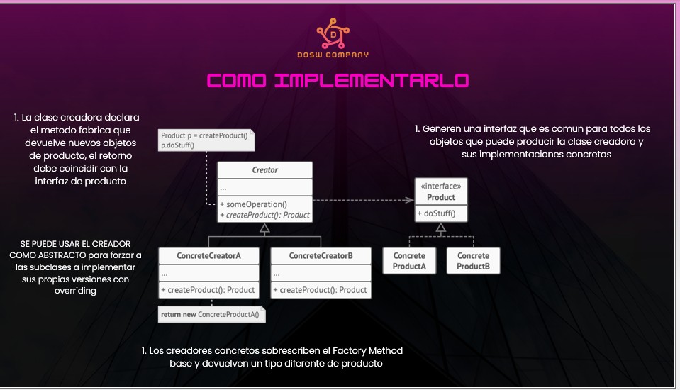
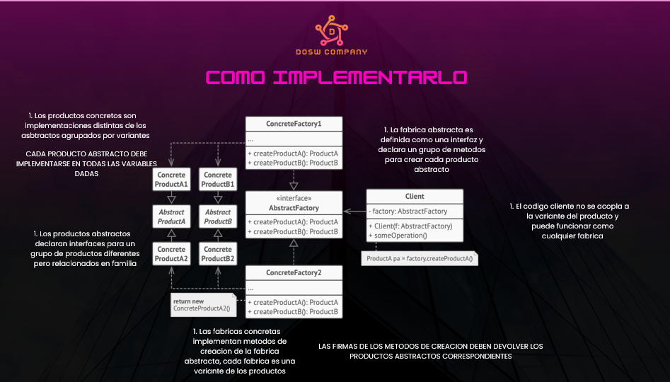
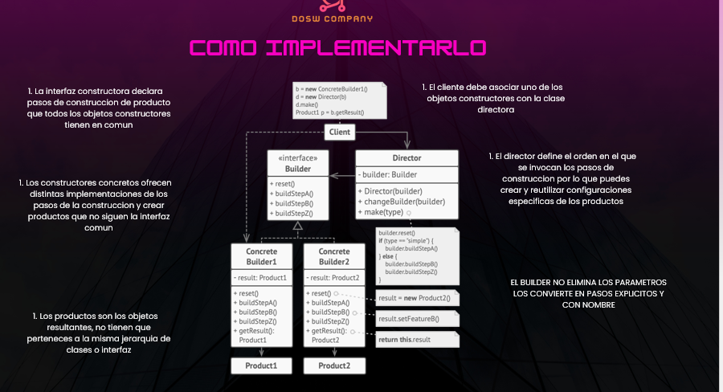
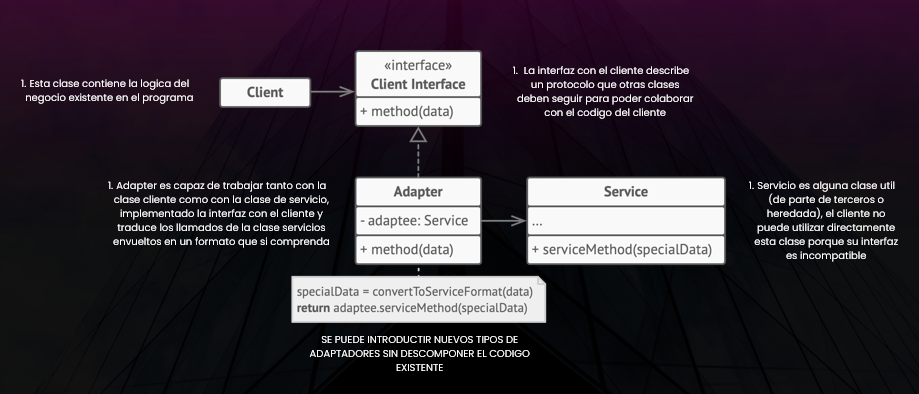
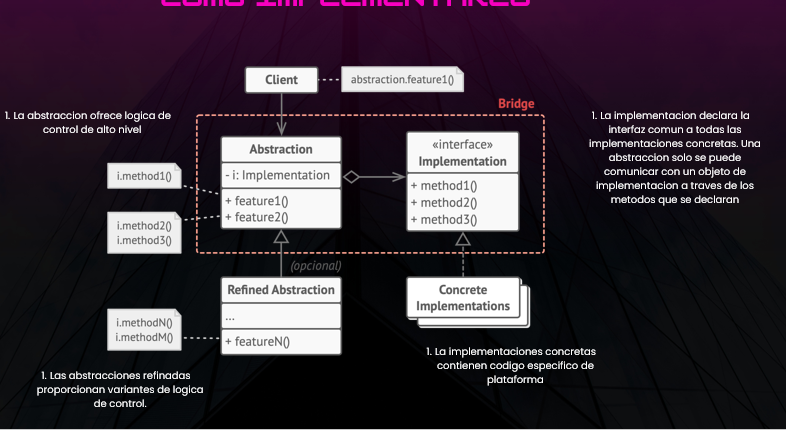
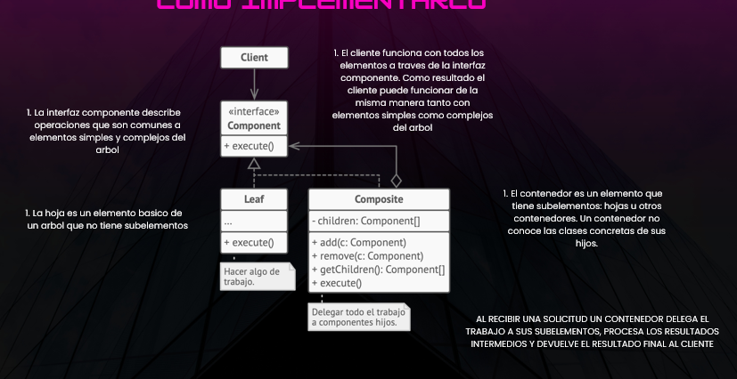
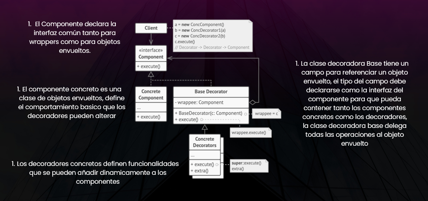

## Ejercicio 1 — Factory Method: Plataforma de Pagos
- Enunciado
Una plataforma de comercio electrónico procesa pagos usando distintos métodos: Tarjeta de Crédito, PayPal y Transferencia Bancaria. El sistema no debe acoplarse a las clases concretas de cada tipo de pago. Los pagos son con decimales y cada pago debe mostrar: "Pago con METODO por $ MONTO".

- Patrón aplicado
Factory Method (Patrón Creacional). Define una interfaz para crear objetos, pero deja que las subclases decidan qué clase instanciar.

- Estrategia de solución
El problema central es que el sistema no puede depender directamente de CreditCardPayment, PaypalPayment o BankTransferPayment, porque eso lo acoplaría a implementaciones concretas. La solución es crear una clase abstracta PaymentProcessor que tenga el método processPayment() ya implementado, y dentro de él llame a createPayment(), que es el Factory Method, es decir, un método abstracto que cada subclase implementa a su manera. Así CreditCardProcessor devuelve un CreditCardPayment, PaypalProcessor devuelve un PaypalPayment, y así sucesivamente. En el Main, la variable se declara como PaymentProcessor (el tipo padre abstracto) y se le asigna cualquier procesador concreto sin problema, porque todos heredan de él.
Payment → interfaz con el contrato pay(double amount)
CreditCardPayment, PaypalPayment, BankTransferPayment → implementan Payment
PaymentProcessor → clase abstracta con el Factory Method createPayment()
CreditCardProcessor, PaypalProcessor, BankTransferProcessor → extienden PaymentProcessor y sobreescriben createPayment()

## Ejercicio 2 — Abstract Factory: Motor de Videojuegos
- Enunciado
Una empresa desarrolla videojuegos que deben ejecutarse en distintas consolas (PlayStation y Xbox). Cada consola ofrece una familia de componentes compatibles entre sí: Control, Juego e Interfaz Gráfica. El motor del juego no debe conocer las implementaciones concretas; solo debe poder conectar el control, iniciar el juego y renderizar la interfaz.
- Patrón aplicado
Abstract Factory (Patrón Creacional). Proporciona una interfaz para crear familias de objetos relacionados sin especificar sus clases concretas.
- 
- Estrategia de solución
El problema es que hay múltiples productos (Controller, Game, UI) y múltiples familias (PlayStation, Xbox), y todos deben ser compatibles dentro de su familia. La solución es definir interfaces para cada producto y luego una interfaz ConsoleFactory que agrupa un método de creación por cada producto. PlayStationFactory implementa esa interfaz devolviendo objetos PlayStation, y XboxFactory devuelve objetos Xbox. El GameEngine recibe una ConsoleFactory por constructor, así nunca sabe si está trabajando con PlayStation o Xbox; simplemente llama createController(), createGame() y createUI(). Cambiar de consola en el Main es tan simple como cambiar qué fábrica se le pasa al GameEngine.
Controller, Game, UI → interfaces de productos con connect(), start(), render()
PlayStationController/Game/UI y XboxController/Game/UI → implementaciones concretas por consola
ConsoleFactory → fábrica abstracta con createController(), createGame(), createUI()
PlayStationFactory, XboxFactory → implementan ConsoleFactory devolviendo su familia
GameEngine → motor que usa ConsoleFactory sin conocer la consola concreta
- 
## Ejercicio 3 — Builder: Fábrica de Muñecos
- Enunciado
Una fábrica de juguetes produce muñecos con distintas configuraciones. El proceso de ensamblaje es siempre el mismo (cabeza, cuerpo, brazos, piernas, accesorios), pero el resultado varía según el tipo: Muñeco de Acción o Muñeca Clásica. La fábrica quiere separar el proceso de construcción del objeto final.
- Patrón aplicado
Builder (Patrón Creacional). Separa la construcción de un objeto complejo de su representación, permitiendo que el mismo proceso cree distintas representaciones.

- Estrategia de solución
El problema es que construir un ToyDoll implica muchos pasos y el resultado varía según el tipo de muñeco. Si todo eso estuviera en el constructor sería un caos. La solución es crear la interfaz ToyDollBuilder con un método por cada paso de construcción y un getResult() al final. ActionDollBuilder y ClassicDollBuilder implementan esa interfaz con valores propios para cada paso. Luego, ToyFactory actúa como Director: recibe cualquier builder y ejecuta los pasos siempre en el mismo orden, garantizando que el proceso sea consistente sin importar el tipo de muñeco. El Main solo necesita crear el builder correcto, pasárselo al director, y pedir el resultado.
Clases y roles:

ToyDoll → producto final con atributos y showInfo()
ToyDollBuilder → interfaz con los pasos de construcción y getResult()
ActionDollBuilder → construye un muñeco de acción con accesorios
ClassicDollBuilder → construye una muñeca clásica sin accesorios
ToyFactory → director que orquesta los pasos en orden

## Ejercicio 4 — Adapter: Gasolinería Inteligente
- Enunciado
Una gasolinería fue diseñada para atender vehículos a combustión con un sistema que trabaja en litros (FuelService). Con la llegada de vehículos eléctricos, se incorporan cargadores de distintos proveedores (FastElectricCharger y SlowElectricCharger) cuyas interfaces no pueden modificarse. El sistema central tampoco puede cambiar. Se deben unificar bajo una sola interfaz. La conversión es: cargador rápido multiplica litros × 8.0 para obtener kWh, cargador lento multiplica litros × 7.0.
- Patrón aplicado
- Adapter (Patrón Estructural). Permite que clases con interfaces incompatibles trabajen juntas sin modificar ninguna de ellas.

- Estrategia de solución
El problema es que el sistema central solo entiende supply(int litros), pero los cargadores eléctricos tienen métodos completamente distintos (fastCharge(double kWh) y slowCharge(double kWh)). No se puede modificar ninguna de esas clases. La solución es crear adaptadores que implementen FuelService (para que el sistema los acepte como si fueran servicio normal) y que internamente tengan una referencia al cargador eléctrico real. Cuando el sistema llama supply(40), el adaptador convierte esos 40 litros a kWh y se los pasa al cargador eléctrico. Para el sistema central es transparente: solo ve FuelService.

FuelService → interfaz objetivo del sistema central con supply(int amount)
GasPump → ya compatible, se usa directamente
FastElectricCharger, SlowElectricCharger → clases externas incompatibles, no modificables
FastChargerAdapter → implementa FuelService, convierte litros × 8.0 y llama fastCharge()
SlowChargerAdapter → implementa FuelService, convierte litros × 7.0 y llama slowCharge()

