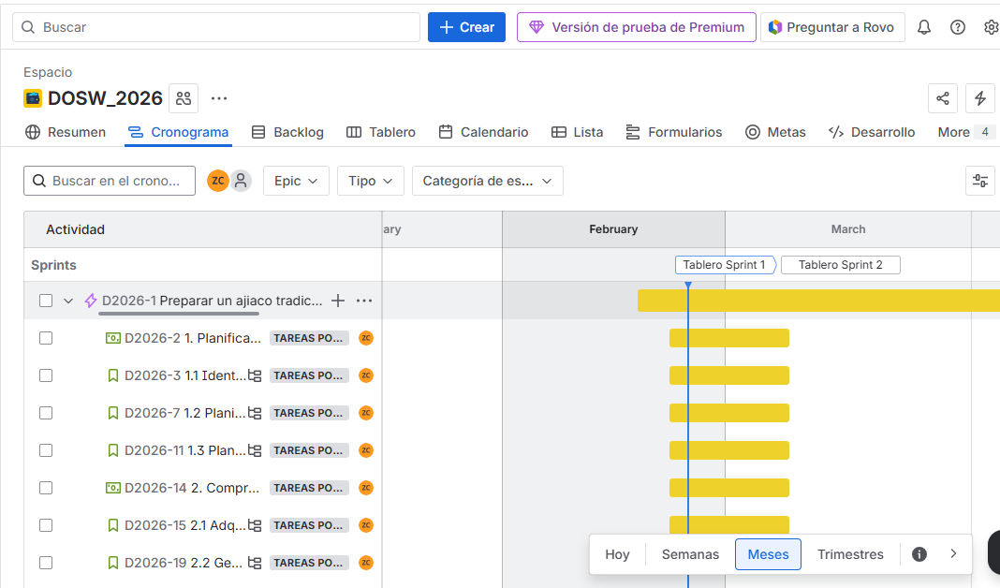
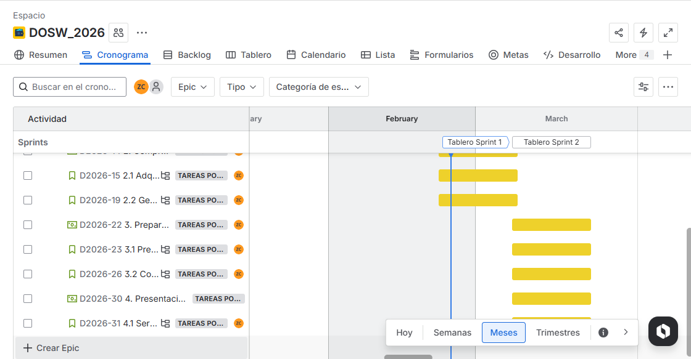
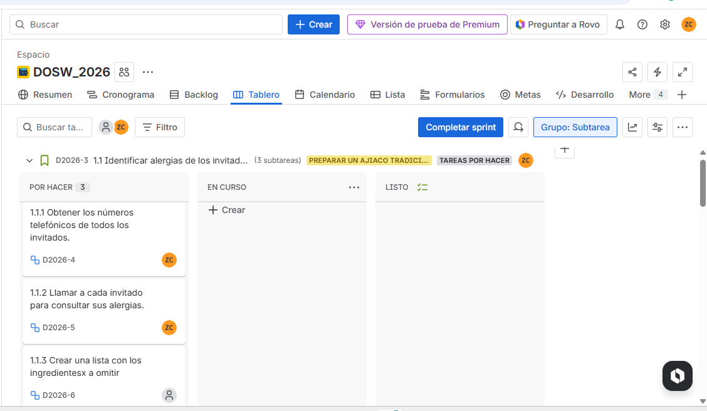
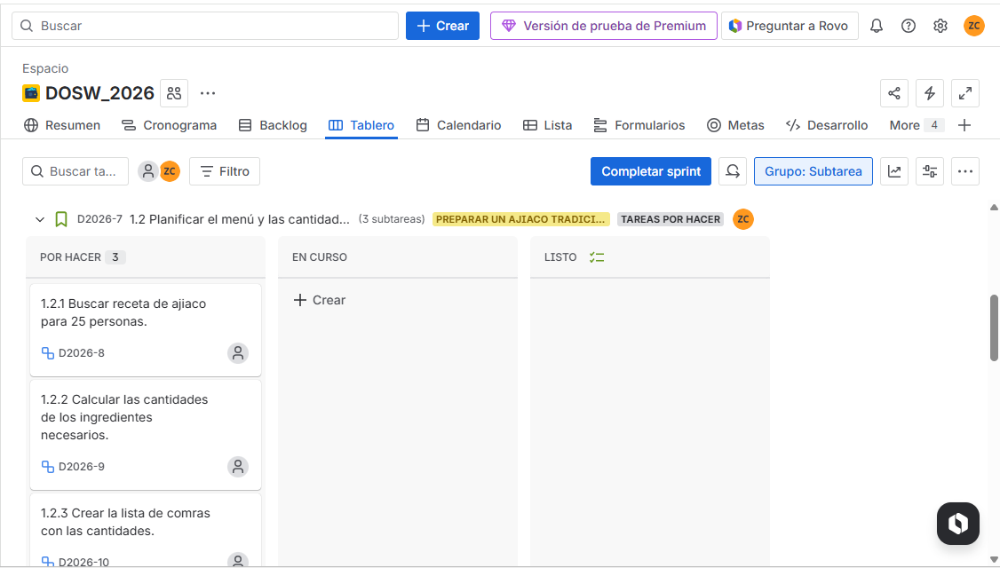

# ¿Que teniamos que hacer esta semana?
Esta semana teninamos como tarea crear un proyecto en jira sobre la preparacion de un ajiaco para 20 personas, el proyecto debia tener la epic, feature, historia de usuario(con como quiero para poder), y las tareas.
- link de jira: https://mail-team-u3ua8mon.atlassian.net/jira/software/projects/D2026/boards/68/backlog

-Para las historias de ususario(como[rol], quiero[accion],para poder[objetivo])
asi:
- HU 1.1 : Como anfitrion quiero conocer las alergias de mis invitados para poder indentificar los ingredientes que debo omitir.

## Paso a paso que segui para crear el proyecto en jira
- 1. crear espacio
- 2. desarrollo de software
- 3. scrum
- 4. darle en mas crear, despues epic
- 5. la actividad fearure no me aparecia entonces toco crearla, se le da en los 3 puntos al lado del nombre del proyecto, despues configurar espacio,y en tipos de actividades se le da añadir tipo de actividad y se le cambia el logo
- 6.  despues para crear la feature planificar elaboracion ajiaco en cronogrma se le da a los tres puntosdel epic que creamos , se le da crear actividad y crear actividad secuendaria
- 7. luego de crear el user history, para crear el stack se hace dentro del user story como subtarea
- 8. para que aparezcan las actividades en tareas toca ir a backlog y trasladarlos al tablero sprint que esta arriba
- 9. y para que en tablero aparezcan las subtareas toca en grupo filtrar y selecciolnar subtareas

## ¿Qué entendía mal antes?
No sabia usar la herramineta gira. 
cuando abir mi cuenta de gira cree el proyecto y habia realizaso la mitad del trabajo, pero cuando volvi a abrir jira al dia siguiete el espacio que habia creado no aparecio, enotces me toco volver a crear otra vez el proyecto

## ¿Qué entiendo ahora?
Aprendi a crear feature, porque al comienzo no me parecia la opcion de feature
Las HU deben tener la misma estructura
Aprendi a crear tareas.

## ¿Qué me falta reforzar?
- No logre que las HU quedaran dentro de las feature, todavia nose como se hace.

