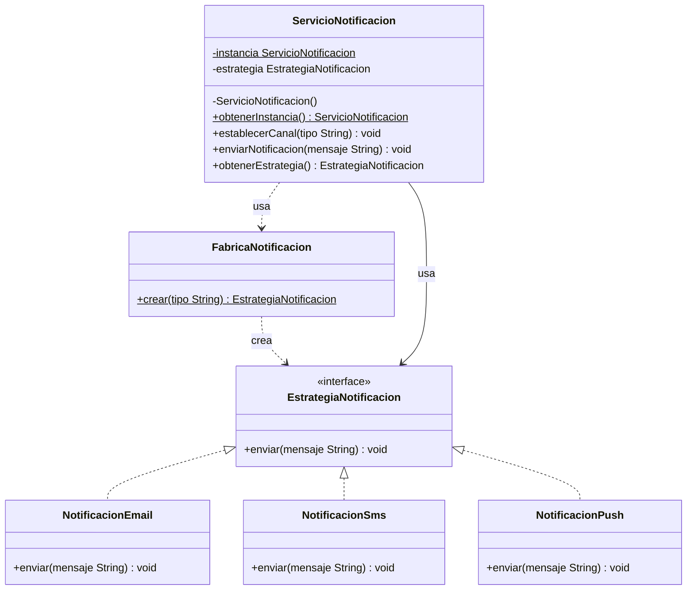

```mermaid
classDiagram
    class ProveedorPago {
        <<interface>>
        +procesarPago(monto double) boolean
    }

    class AdaptadorPayPal {
        -apiPayPal ApiPayPal
        +AdaptadorPayPal(apiPayPal ApiPayPal)
        +procesarPago(monto double) boolean
    }

    class AdaptadorStripe {
        -apiStripe ApiStripe
        +AdaptadorStripe(apiStripe ApiStripe)
        +procesarPago(monto double) boolean
    }

    class AdaptadorTarjetaCredito {
        -apiTarjetaCredito ApiTarjetaCredito
        +AdaptadorTarjetaCredito(api ApiTarjetaCredito)
        +procesarPago(monto double) boolean
    }

    class AdaptadorTransferenciaBancaria {
        -apiTransferencia ApiTransferenciaBancaria
        +AdaptadorTransferenciaBancaria(api ApiTransferenciaBancaria)
        +procesarPago(monto double) boolean
    }

    class ApiPayPal {
        +ejecutarPago(total double) void
    }

    class ApiStripe {
        +cobrar(montoCentavos int) boolean
    }

    class ApiTarjetaCredito {
        +enviarCargo(monto double, moneda String) String
    }

    class ApiTransferenciaBancaria {
        +iniciarTransferencia(monto double) void
    }

    class ManejadorValidacion {
        <<abstract>>
        #siguiente ManejadorValidacion
        +establecerSiguiente(siguiente ManejadorValidacion) ManejadorValidacion
        +validar(monto double) boolean*
        #pasarAlSiguiente(monto double) boolean
    }

    class ValidadorSaldo {
        -saldoDisponible double
        +ValidadorSaldo(saldoDisponible double)
        +validar(monto double) boolean
    }

    class ValidadorFraude {
        -UMBRAL_FRAUDE double$
        +validar(monto double) boolean
    }

    class ValidadorLimite {
        -limiteTransaccion double
        +ValidadorLimite(limiteTransaccion double)
        +validar(monto double) boolean
    }

    class ServicioPago {
        -proveedor ProveedorPago
        -cadenaValidacion ManejadorValidacion
        +ServicioPago(proveedor, cadenaValidacion)
        +pagar(monto double) boolean
    }

    ProveedorPago <|.. AdaptadorPayPal
    ProveedorPago <|.. AdaptadorStripe
    ProveedorPago <|.. AdaptadorTarjetaCredito
    ProveedorPago <|.. AdaptadorTransferenciaBancaria

    AdaptadorPayPal --> ApiPayPal
    AdaptadorStripe --> ApiStripe
    AdaptadorTarjetaCredito --> ApiTarjetaCredito
    AdaptadorTransferenciaBancaria --> ApiTransferenciaBancaria

    ManejadorValidacion <|-- ValidadorSaldo
    ManejadorValidacion <|-- ValidadorFraude
    ManejadorValidacion <|-- ValidadorLimite
    ManejadorValidacion --> ManejadorValidacion : siguiente

    ServicioPago --> ProveedorPago
    ServicioPago --> ManejadorValidacion
```

#  Combinación de Patrones de Diseño

---

## Como identificar los patrones

| Si el enunciado dice... | Patrón a usar |
|---|---|
| "una sola instancia", "servicio centralizado", "evitar múltiples instancias" | **Singleton** |
| "el comportamiento cambia en tiempo de ejecución", "canal dinámico", "seleccionar algoritmo" | **Strategy** |
| "agregar nuevos tipos sin modificar el código existente", "creación centralizada" | **Factory Method** |
| "APIs externas con interfaces diferentes", "adaptador", "cada proveedor tiene su propia API" | **Adapter** |
| "validaciones en cadena", "cada paso decide si continúa", "validaciones configurables" | **Chain of Responsibility** |

### Regla de oro — Chain of Responsibility
Si tienes que **validar varias cosas en secuencia** y cada una puede detener el proceso, usa Chain of Responsibility. El flujo es: cada eslabón valida su condición, si falla retorna `false` y corta la cadena, si pasa llama a `pasarAlSiguiente()`.

Ejemplos donde siempre aplica:
- Validar saldo → validar fraude → validar límite
- Validar formato → validar permisos → validar cuota
- Verificar autenticación → verificar autorización → verificar restricciones

### Regla de oro — Adapter
Si tienes una clase externa que **no puedes modificar** y su método tiene una firma diferente a la que necesita tu sistema, usa Adapter. El Adapter envuelve la clase externa y expone el método que tu sistema entiende. Cada proveedor externo tiene su propio método (`ejecutarPago`, `cobrar`, `enviarCargo`) pero tu sistema solo habla con `procesarPago`.

### Regla de oro — Strategy
Si el **comportamiento de una operación cambia en tiempo de ejecución** según una elección del usuario o del sistema, usa Strategy. Define una interfaz con el contrato y crea una implementación por variante. El objeto que contiene la estrategia puede cambiarla sin ser reconstruido.

---

## Ejercicio 1: Sistema de Notificaciones

### Patrones utilizados

| Patrón | Tipo | Por qué se usa |
|---|---|---|
| **Strategy** | Comportamental | El canal de envío (Email, SMS, Push) cambia dinámicamente. Cada canal implementa el mismo contrato `enviar()` pero con lógica propia. Agregar un canal nuevo no requiere tocar el servicio. |
| **Singleton** | Creacional | El enunciado exige "un servicio centralizado que evite múltiples instancias". El constructor es privado y el acceso es solo por `obtenerInstancia()`. |
| **Factory Method** | Creacional | El enunciado pide "agregar nuevos tipos sin modificar el código existente". La fábrica centraliza la creación: recibe un String y devuelve la estrategia correcta. El servicio nunca hace `new` directamente. |

### Diagrama de clases




### Estrategia de solución

1. Se define `EstrategiaNotificacion` como interfaz con un solo método `enviar()`. Este es el contrato que todos los canales deben cumplir.
2. Se crean `NotificacionEmail`, `NotificacionSms` y `NotificacionPush`, cada una con su propia implementación de `enviar()`.
3. Se crea `FabricaNotificacion` con un método estático `crear(String tipo)` que usa un switch para devolver la instancia correcta. Si el tipo no existe, lanza `IllegalArgumentException`.
4. Se crea `ServicioNotificacion` como Singleton con constructor privado, campo `volatile` y doble verificación en `obtenerInstancia()`. Internamente tiene una referencia a `EstrategiaNotificacion` que puede cambiar con `establecerCanal()`.
5. El flujo completo: `obtenerInstancia()` → `establecerCanal("EMAIL")` → internamente llama `FabricaNotificacion.crear("EMAIL")` → guarda la estrategia → `enviarNotificacion("Hola")` → llama `estrategia.enviar("Hola")`.

### Cómo interactúan los tres patrones

```
ServicioNotificacion (Singleton)
    │
    ├── establecerCanal("SMS")
    │       │
    │       └── FabricaNotificacion.crear("SMS")  ← Factory Method
    │               │
    │               └── new NotificacionSms()
    │
    └── enviarNotificacion("Tu código es 1234")
            │
            └── estrategia.enviar(...)             ← Strategy
                    │
                    └── [SMS] Tu código es 1234
```

### Pruebas unitarias

| Test | Qué valida |
|---|---|
| `testSingletonMismaInstancia` | `obtenerInstancia()` siempre retorna el mismo objeto (`assertSame`) |
| `testEstrategiaEmail` | `establecerCanal("EMAIL")` asigna una `NotificacionEmail` |
| `testEstrategiaSms` | `establecerCanal("SMS")` asigna una `NotificacionSms` |
| `testEstrategiaPush` | `establecerCanal("PUSH")` asigna una `NotificacionPush` |
| `testCanalInvalidoLanzaExcepcion` | Canal desconocido lanza `IllegalArgumentException` |
| `testEnviarSinCanalLanzaExcepcion` | Enviar sin canal configurado lanza `IllegalStateException` |
| `testEnvioExitosoNoLanzaExcepcion` | Flujo completo no lanza ninguna excepción |

---

## Ejercicio 2: Sistema de Procesamiento de Pagos

### Patrones utilizados

| Patrón | Tipo | Por qué se usa |
|---|---|---|
| **Adapter** | Estructural | Cada proveedor externo tiene su propia API que no se puede modificar. El Adapter traduce esas APIs al contrato interno `ProveedorPago`. El sistema nunca habla directamente con PayPal, Stripe, etc. |
| **Chain of Responsibility** | Comportamental | Las validaciones deben ejecutarse en orden y cada una puede cortar el proceso. Se pueden agregar o quitar validaciones sin tocar el servicio de pago. |
| **Factory Method** | Creacional | Cada Adapter encapsula la construcción de su API externa. `ServicioPago` recibe un `ProveedorPago` sin conocer la implementación concreta, lo que permite agregar proveedores sin modificar el servicio. |

### Diagrama de clases



### Estrategia de solución

1. Se define `ProveedorPago` como interfaz interna con `procesarPago(double monto)`. Este es el único contrato que el sistema conoce.
2. Se crean las clases en el paquete `externo` que simulan las SDKs reales de cada proveedor, con sus métodos propios y firmas distintas.
3. Se crean los Adapters: cada uno recibe la API externa por constructor, implementa `ProveedorPago` y dentro de `procesarPago()` llama al método específico de la API realizando las conversiones necesarias (`double` a centavos en Stripe, `String` a `boolean` en TarjetaCredito).
4. Se crea `ManejadorValidacion` como clase abstracta con `establecerSiguiente()` (retorna el siguiente para encadenar en una línea) y `pasarAlSiguiente()` como helper que evita repetir el `if (siguiente == null)` en cada validador.
5. Se crean los tres validadores. Cada uno imprime su resultado y o corta retornando `false` o llama `pasarAlSiguiente()`.
6. `ServicioPago` recibe el proveedor y la cadena por constructor. En `pagar()` primero corre toda la cadena y solo si pasa llama al proveedor.

### Cómo funciona la cadena de validación

```
validadorSaldo.establecerSiguiente(validadorFraude).establecerSiguiente(validadorLimite)

Flujo con monto $200, saldo $1000, límite $500:

validadorSaldo.validar(200)   → OK  → pasarAlSiguiente(200)
  validadorFraude.validar(200)  → OK  → pasarAlSiguiente(200)
    validadorLimite.validar(200)  → OK  → pasarAlSiguiente(200)
      siguiente == null → return true
→ proveedor.procesarPago(200) → EXITOSO

Flujo con monto $400, saldo $1000, límite $300:

validadorSaldo.validar(400)   → OK  → pasarAlSiguiente(400)
  validadorFraude.validar(400)  → OK  → pasarAlSiguiente(400)
    validadorLimite.validar(400)  → RECHAZADO → return false
→ pago RECHAZADO (el proveedor nunca se llama)
```

### Cómo agregar un nuevo proveedor sin modificar código existente

```java
// 1. Crear la API externa
public class ApiMercadoPago {
    public int realizarPago(double monto) { return 200; }
}

// 2. Crear el Adapter
public class AdaptadorMercadoPago implements ProveedorPago {
    private final ApiMercadoPago api;
    public AdaptadorMercadoPago(ApiMercadoPago api) { this.api = api; }

    @Override
    public boolean procesarPago(double monto) {
        return api.realizarPago(monto) == 200;
    }
}

// 3. Usar en ServicioPago — no se toca ninguna clase existente
ProveedorPago mp = new AdaptadorMercadoPago(new ApiMercadoPago());
ServicioPago servicio = new ServicioPago(mp, cadena);
```

### Pruebas unitarias

| Test | Qué valida |
|---|---|
| `testPagoExitosoConPayPal` | Flujo completo con PayPal, monto válido retorna `true` |
| `testPagoExitosoConStripe` | Flujo completo con Stripe, conversión a centavos correcta |
| `testPagoExitosoConTarjetaCredito` | `"APROBADO"` se convierte correctamente a `true` |
| `testPagoExitosoConTransferencia` | Flujo completo con transferencia bancaria |
| `testRechazadoPorSaldoInsuficiente` | Cadena corta en el primer eslabón |
| `testRechazadoPorFraude` | Cadena corta en el segundo eslabón (monto > 9000) |
| `testRechazadoPorLimiteTransaccion` | Cadena corta en el tercer eslabón |
| `testCadenaConSoloUnValidador` | Cadena de un solo eslabón funciona correctamente |
| `testTodosLosAdaptadoresImplementanProveedorPago` | Todos los adapters son instancias de `ProveedorPago` |

---

## Comandos Maven

```bash
# Ejecutar pruebas y generar reporte de cobertura
mvn clean verify

# El reporte JaCoCo queda en:
# target/site/jacoco/index.html

# Análisis estático con SonarQube
mvn sonar:sonar -Dsonar.host.url=http://localhost:9000 -Dsonar.token=TU_TOKEN
```
